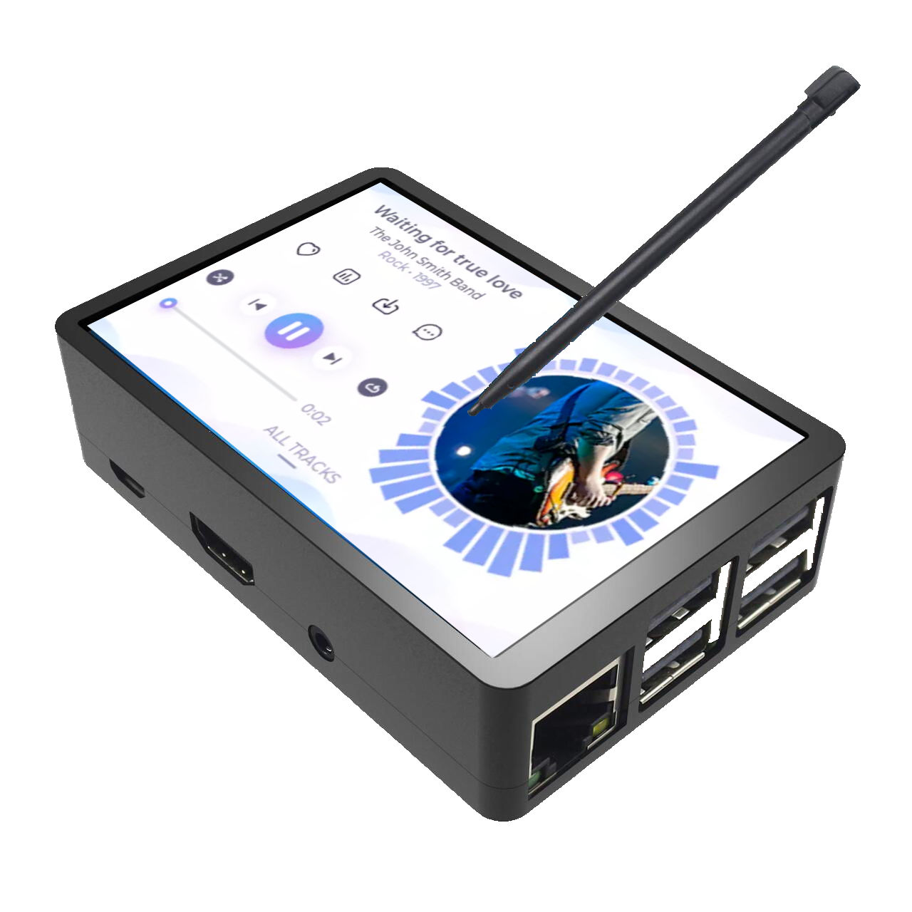

# LVGL for Raspberry PI
LVGL port for Raspberry PI tested with 3B+ and LCD MHS35.
<br>
This project intends to be embedded and run standalone without HDMI Monitor/Keyboard/mouse. For development you can use those but LCD runs independent.
<br>
Note that most projects mirror HDMI to LCD so the drivers scripts (LCD-show repo) usually builds a frame-buffer copy application. In this project we do not want this and so we comment out the LCD-show in our recommended script (MHS35-varanda-show). We also suggest to prevent touch events to be dispatched to the HDMI screen in order to be 100% independent.

<!--
[Amazon link](https://www.amazon.ca/Raspberry-320x480-Monitor-Raspbian-RetroPie/dp/B07NSCWY8Z/ref=dp_prsubs_1?pd_rd_w=kRIla&content-id=amzn1.sym.67faf40b-f3a2-47fe-ac16-aeedabee5309&pf_rd_p=67faf40b-f3a2-47fe-ac16-aeedabee5309&pf_rd_r=0MDZ0W735CQRSGBBV0VQ&pd_rd_wg=Inx2C&pd_rd_r=2dec925f-5e0b-4f70-ab81-0dc9358cde49&pd_rd_i=B07NSCWY8Z&psc=1)

 -->



# Rasbian
All steps in the following instructions should be performed in the Raspberry running [Rasbiian](https://www.raspberrypi.com/software/).<br>
There may be need to install some packages (ex: build-essential, git, etc)

# Driver Installation
Clone the repo: https://github.com/mvaranda/LCD-show/tree/varanda abd checkour branch varanda:
```
git clone https://github.com/mvaranda/LCD-show.git
cd LCD-show
git checkout varanda
chmod +x MHS35-varanda-show
sudo ./MHS35-varanda-show
```

## disable touch events to be posted to HDMI screen

To disable Touch for HDMI you can add to .bashrc:
```
   DISPLAY=:0 xinput disable 6
```
   Where 6 is the ID. ID can be seen using:
- DISPLAY=:0 xinput --list
- use evtest to see Touch events.

# Build LVGL App

Clone this repo and "make" it:
```
git clone https://github.com/Varanda-Labs/lvgl-rpi.git
cd lvgl-rpi
git submodule update --init
make
./lvgl_app
```
To exit the app you can "Control-C"

# RPI 4
I started testing with RPI-4.
For now I have created a makefile just for the branch lvgl-music-demo. To build it:
```
make -f rpi4.mk
```
Need more test.
<br>
info  about drivers: https://github.com/notro/fbtft/wiki/Device-Tree


